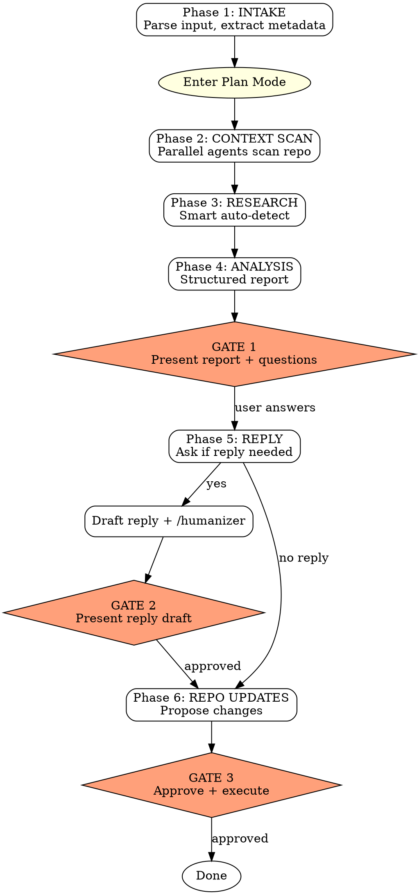

# Analyze Communications

Gated multi-phase workflow for processing incoming communications against full project context. Produces a structured analysis report, optionally drafts a humanized reply, and proposes repo updates to keep project state accurate.

**Invocation:** `/analyze-comms` followed by pasted text or a file path.
**Optional destination hint:** `/analyze-comms legal` or `/analyze-comms deliverables/emails/` to override default file placement.

## Architecture



## Phase 1: Intake

Runs before plan mode. Fast and non-destructive.

### Detect input

1. Check if the user provided a file path (PDF, DOCX, XLSX, image). If so, read it using the Read tool. For large PDFs (10+ pages), read the first 10 pages first and ask if more is needed.
2. If no file path, treat the user's message as the communication text.
3. If neither text nor file is detected, prompt: "Please paste the communication text or provide a file path to the document."
4. Check for a destination path hint after `/analyze-comms` (e.g., `legal`, `deliverables/emails/`). Store it for Phase 6.

### Extract metadata

Parse the communication and identify:

| Field | What to extract |
|-------|----------------|
| **Sender** | Person name + organization or role |
| **Date** | When the communication was sent |
| **Type** | Email reply, legal review, vendor update, status report, invoice, meeting notes, etc. |
| **Topic tags** | Areas touched: legal, technical, vendor, financial, compliance, timeline, etc. |
| **Urgency** | Deadlines mentioned, action-required language, time-sensitive indicators |

Present a one-liner summary for confirmation:
> "[Type] from [Sender] ([Org]) re: [topic]. [Urgency note if any]."

Then enter plan mode and proceed to Phase 2.

## Phase 2: Context Scan

Build a complete picture of where the project stands relative to this communication. Read `CLAUDE.md` first to discover the project's structure and conventions.

### Launch parallel agents

Use up to 3 Explore agents in a single message:

**Agent 1 — Project State:**
Read `CLAUDE.md`, `PROJECT_STATUS.md` (or equivalent status tracker), and any memory files. Report: current phase, active blockers, pending items, recent completions. Summarize in under 300 words.

**Agent 2 — Related Communications:**
Search the project for prior communications with the same sender or on the same topic. Use Glob to find email files, Grep to search for the sender's name and topic keywords. Read the most relevant 3-5 files. Report: conversation history, last known state of discussion, any open threads.

**Agent 3 — Relevant Docs:**
Based on topic tags from Phase 1, find and read strategy documents, architecture decision records, technical docs, or legal documents that provide context. Report: relevant decisions already made, constraints in play, open questions this communication might address.

### Synthesize

Combine agent findings into a **Context** section in the plan:
- Current project state (1 paragraph)
- Prior communication thread with this sender (bullet list)
- Relevant decisions and constraints (bullet list)
- Open questions this communication might address (bullet list)

## Phase 3: Research (Smart Auto-Detect)

Evaluate whether external research is needed based on the communication content.

### Decision criteria

Research is triggered when the communication mentions:
- A **regulation, law, or compliance requirement** you are not confident about
- A **specific tool, API, or technical concept** that may have updated docs or best practices
- A **negotiation tactic, legal clause, or industry norm** worth verifying
- A **competitive product or market term** worth understanding

Research is skipped when:
- The communication is a **routine status update** with no unfamiliar concepts
- All topics are already covered by project documentation and memory
- The sender is confirming something previously discussed

### When research triggers

1. Use WebSearch for up to 3 focused queries
2. Use WebFetch to read the most relevant results
3. Summarize findings in the plan under a **Research** section with sources cited
4. Keep research focused on what informs the analysis — do not dump raw search results

### When research is skipped

Note in the plan: "No external research needed — communication covers familiar ground."

## Phase 4: Analysis

The core deliverable. Read `references/report-template.md` (relative to this SKILL.md) for the full template and formatting conventions.

Produce a structured report with these 6 required sections:

1. **Summary** — 2-3 sentences. Specific headline takeaway, not generic.
2. **Key findings** — Bullet list. Each finding tagged as new information, confirmation, change, or contradiction relative to what was previously known.
3. **Implications** — Three categories: for the project (timeline, scope, deliverables), for the user (decisions, actions), for the client (relationship, expectations).
4. **Risk assessment** — New risks introduced, existing risks resolved or escalated, risk level changes with references to any existing risk tracking in the repo.
5. **Action items** — Numbered checklists grouped by: immediate (this week), short-term (next 2 weeks), pending decision.
6. **Questions for you** — Clarifying questions, ambiguities, decisions needed, strategic direction input.

### GATE 1

**STOP.** Present the full analysis report to the user. Ask all clarifying questions from Section 6 using AskUserQuestion or direct questions in text.

Do not proceed to Phase 5 until the user has responded to your questions. Their answers will inform the reply draft and repo update decisions.

## Phase 5: Reply Decision and Draft

### Ask the user

After GATE 1 answers are received, ask: "Do you want me to draft a reply to [sender]?"

**If no:** Skip directly to Phase 6.

**If yes:** Ask for direction before drafting:
- What tone? (professional, warm, firm, casual)
- Key points to hit?
- Anything to specifically avoid or not mention?

### Draft the reply

1. Follow the email conventions found in the project's existing email files (search `deliverables/emails/` or equivalent for prior outgoing emails). Match the format: header metadata, structured sections, action items, signature block.
2. Use the analysis findings and the user's direction to inform the content.
3. Search the repo for 1-2 prior outgoing emails by the user to use as a voice sample.
4. Invoke the `/humanizer` skill via the Skill tool. Pass the draft text and the voice sample file paths for voice calibration. Let the humanizer do a full pass to strip AI patterns and match the user's writing voice.
5. Present the humanized draft in the plan.

### GATE 2

**STOP.** Present the reply draft to the user for review. Wait for approval, edits, or rejection before proceeding to Phase 6.

### Save and present reply file

After GATE 2 approval, the reply draft is **always** saved as a markdown file in `deliverables/emails/` (or the destination hint directory). Use the naming convention `[recipient]_[topic]_[date].md`.

After saving, present the file path prominently so the user can copy-paste:

> **Reply saved:** `deliverables/emails/[filename].md` — open this file to copy-paste into your email client.

This is not optional. Every approved reply must be saved and its path presented.

## Phase 6: Repo Update Plan

Evaluate what should be updated in the repository and propose all changes as a manifest. Read `references/report-template.md` for file naming and placement conventions.

### Evaluate each category

1. **Store communication** — If the user provided a PDF or file, propose copying it to the appropriate directory. Create a markdown reference alongside it if useful.
2. **Store analysis** — Always propose saving the structured report as a markdown file. Legal analyses go in `legal/`, everything else in `deliverables/emails/`.
3. **Store reply draft** — If a reply was drafted, propose saving it in `deliverables/emails/`.
4. **Update project status** — Check `PROJECT_STATUS.md` (or equivalent). Propose specific changes: blocker status updates, completed actions, new items.
5. **Update risk tracking** — Check the project's risk document. Propose: resolved risks, escalated risks, new risks.
6. **Update memory** — Identify persistent facts learned from this communication that should be saved for future conversations.
7. **New files** — Any additional files needed (legal breakdowns, analysis documents).
8. **Notes cleanup** — Check if any open questions in scratch notes are now resolved.

### File placement defaults

| Content | Default location |
|---------|-----------------|
| Communication PDFs | `deliverables/emails/pdf/` |
| Legal PDFs | `legal/pdf/` |
| General analyses | `deliverables/emails/` |
| Legal analyses | `legal/` |
| Reply drafts | `deliverables/emails/` |

If the user provided a destination hint at invocation, use it instead.
If a target directory does not exist, include its creation in the manifest.

### Present change manifest

Format proposed changes as:
```
Proposed Repo Changes:
  CREATE  [path] — [description]
  UPDATE  [path] — [specific changes]
  MEMORY  [what to save and why]
```

### GATE 3

**STOP.** Present the change manifest to the user. Wait for approval.

On approval, execute all changes:
1. Create directories if needed
2. Write new files
3. Edit existing files with specific updates
4. Save memory entries
5. Exit plan mode

## Anti-Patterns

Do not do any of the following:

- **Hardcode project paths.** Read `CLAUDE.md` to discover the project's structure. File conventions vary by repo.
- **Skip gates.** Every gate requires the user's explicit response before proceeding.
- **Execute file changes before Gate 3.** All writes happen after the manifest is approved.
- **Run /humanizer on the analysis report.** Humanizer is only for the reply draft in Phase 5.
- **Research routine updates.** If it is a simple status confirmation with nothing unfamiliar, skip Phase 3.
- **Combine multiple communications.** Process one communication per invocation. If the user provides multiple, ask which one to analyze first.
- **Create files without following naming conventions.** Always use `[sender]_[topic]_[date].md` format.

## Examples

### Example 1: Routine vendor update

```
User: /analyze-comms
[pastes: "Hi Tomer, just confirming the API keys are live. Let me know
if you hit any issues. - Jeff"]

Phase 1: Vendor update from Jeff (Wealthica). No urgency.
Phase 2: Scans project status, prior Jeff thread, Wealthica docs.
Phase 3: SKIPPED — routine confirmation.
Phase 4: Report notes API keys confirmed, resolves blocker,
         no new risks, asks about integration timeline.
GATE 1: User answers questions.
Phase 5: User says "yes, brief thank-you." Draft + humanize.
GATE 2: User approves reply.
Phase 6: Proposes updating PROJECT_STATUS.md, saving email.
GATE 3: User approves. Files written.
```

### Example 2: Legal review (complex)

```
User: /analyze-comms legal
[provides path: ~/Downloads/marks_contract_review.pdf]

Phase 1: Legal review from Mark (Kevin's lawyer). Multiple action items.
Phase 2: Scans legal/ directory, prior MSA thread, contract docs.
Phase 3: TRIGGERED — researches liability cap norms in tech consulting.
Phase 4: Detailed report with point-by-point breakdown, risk assessment
         for each counter-position, strategic questions.
GATE 1: User provides direction on accept/counter decisions.
Phase 5: User says "yes, professional but firm." Draft + humanize.
GATE 2: User edits one paragraph, approves.
Phase 6: Proposes: store PDF in legal/pdf/, analysis in legal/,
         reply in deliverables/emails/, update PROJECT_STATUS.md,
         update risks doc, save memory about contract status.
GATE 3: User approves. All files written.
```

## Integration

- **Humanizer** — Invoked via `Skill` tool during Phase 5 for reply voice calibration and AI pattern removal.
- **Ship** — After repo updates are executed, the user can `/ship` to commit, push, and create a PR.
